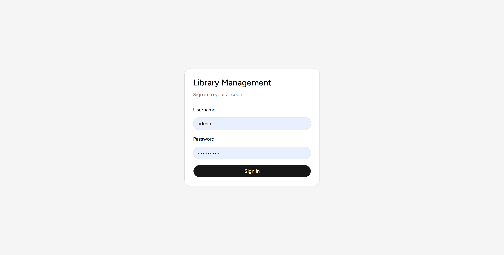
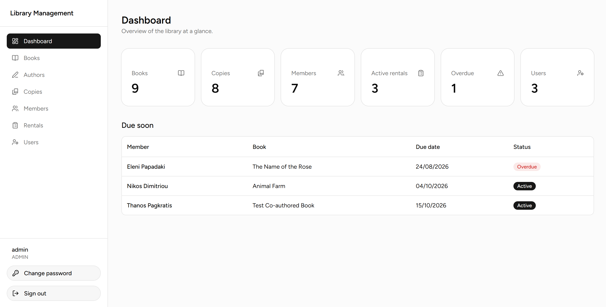
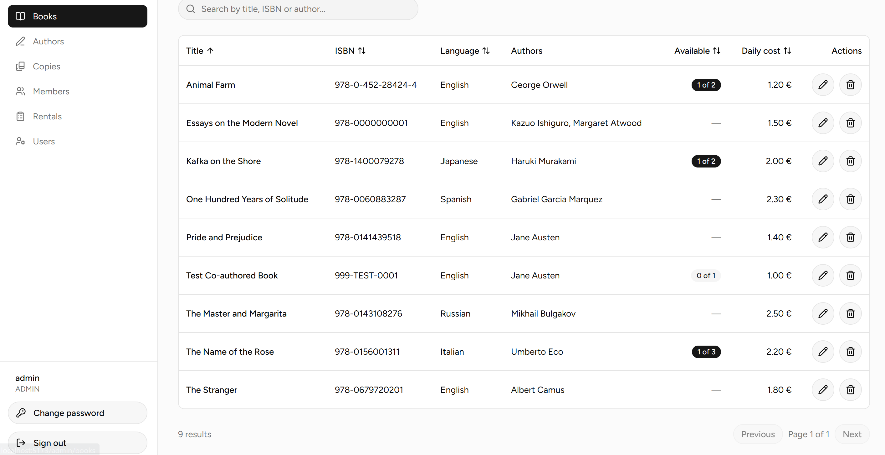
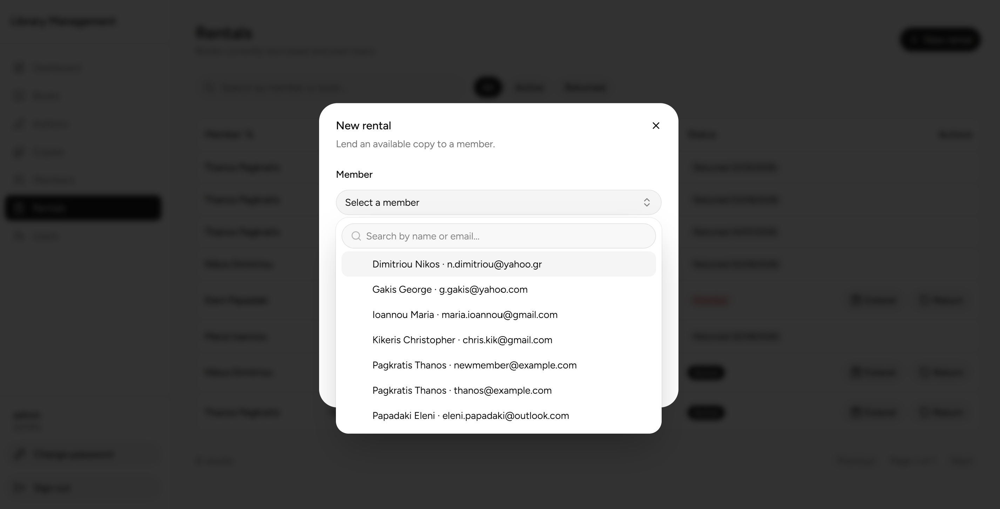
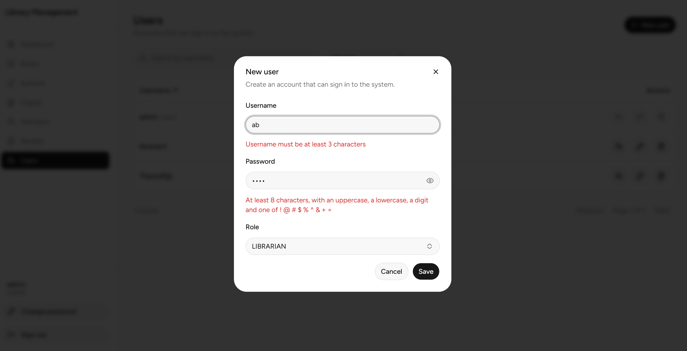
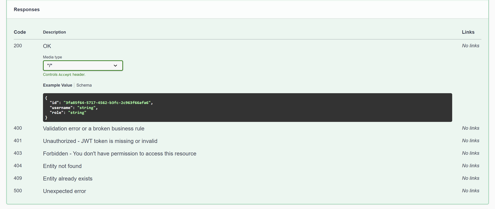
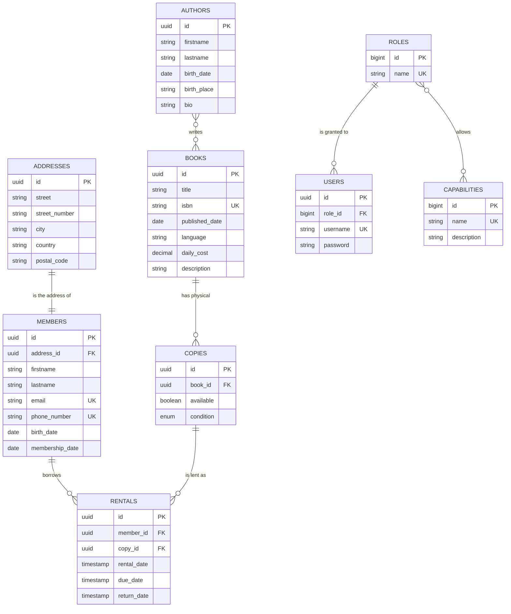

# Library Management

A full stack library management system: a Spring Boot REST API and a React single page
application on top of it, with role based access for administrators and librarians.

---

## Screenshots

| | |
|---|---|
| [](docs/screenshots/login.png) | [](docs/screenshots/dashboard.png) |
| *Sign in* | *Administrator dashboard* |
| [](docs/screenshots/books.png) | [](docs/screenshots/rental-form.png) |
| *Catalogue with availability at a glance* | *Lending a copy to a member* |
| [](docs/screenshots/validation.png) | [](docs/screenshots/librarian.png) |
| *Validation messages land on the field they belong to* | *The same dashboard for a librarian — no user management* |

[](docs/screenshots/swagger.png)

*Every endpoint documents the responses it can return*

---

## Tech Stack

### Backend
- **Java** 21 (Amazon Corretto)
- **Spring Boot** 3.5.11
- **Spring Security** + JWT (jjwt 0.12.6)
- **Spring Data JPA** + Hibernate
- **PostgreSQL** (production) / H2 (tests)
- **Flyway** — database migrations
- **Lombok**
- **Springdoc OpenAPI** 2.8.9 (Swagger UI)
- **Docker** + Docker Compose
- **JaCoCo** 0.8.12 — code coverage
- **JUnit 5** + AssertJ — 482 tests

### Frontend
- **React** 19 + **TypeScript**
- **Vite** 8
- **Tailwind CSS** v4 + **shadcn/ui** (Radix UI)
- **react-router** 7
- **react-hook-form** + **zod**
- **sonner** — toast notifications
- **lucide-react** — icons
- Native `fetch` — no HTTP client library

---

## Repository Layout

```
library-management/
├── src/                          # Spring Boot application
├── library-management-frontend/  # React application
│   ├── Dockerfile                #   build with node, serve with nginx
│   └── nginx.conf                #   history fallback for the router
├── docs/screenshots/             # Images used by this README
├── Dockerfile                    # build with maven, run on a bare JRE
├── docker-compose.yml            # db + api + web
└── pom.xml
```

---

## Prerequisites

- Java 21
- PostgreSQL 13+ (for a local run)
- Node.js 20+ and npm
- Docker & Docker Compose (optional, and the shortest path — it needs neither Java nor PostgreSQL installed)

Maven does not have to be installed: the repository ships the Maven wrapper, so every
`mvn` command below can be run as `./mvnw` on macOS and Linux, or `mvnw.cmd` on Windows.

---

## Quick start with Docker

The whole stack — database, API and web interface — runs from one command. Nothing else
has to be installed: no Java, no Node, no PostgreSQL. Works the same on Windows, macOS
and Linux.

1. **Clone the repository**
```bash
git clone https://github.com/pagkratisthanos/library-management.git
cd library-management
```

2. **Create the `.env` file** from the committed template:
```bash
cp .env.example .env
```

Generate a signing key for the JWT tokens and put it in `APP_SECURITY_SECRET_KEY`.

macOS, Linux, or Git Bash on Windows:
```bash
openssl rand -base64 32
```

Windows PowerShell:
```powershell
$bytes = New-Object byte[] 32
[Security.Cryptography.RandomNumberGenerator]::Create().GetBytes($bytes)
[Convert]::ToBase64String($bytes)
```

3. **Start everything**
```bash
docker compose up --build
```

The first build takes a few minutes while Maven and npm fetch their dependencies. After
that:

| Address | What |
|---------|------|
| http://localhost:5173 | The application |
| http://localhost:8080/swagger-ui/index.html | The API documentation |
| localhost:5433 | PostgreSQL, if you want to inspect it |

Sign in with `admin` / `admin123!`.

### What is running

| Service | Image | Notes |
|---------|-------|-------|
| `db` | postgres:17 | Data lives in the named volume `postgres_data` |
| `app` | built from `Dockerfile` | Spring Boot with the `prod` profile, waits for the database to report healthy |
| `web` | built from `library-management-frontend/Dockerfile` | The built bundle served by nginx |

Both images are multi-stage: the build tools stay in the first stage and never reach the
final image, so what ships is a JRE with a jar, and nginx with static files.

### Everyday commands

```bash
docker compose logs -f app     # follow the application log
docker compose ps              # what is running
docker compose down            # stop and remove the containers
docker compose down -v         # the same, and delete the database volume
```

Without `-v` the data survives a restart. Use `-v` when you want Flyway to build the
schema from scratch.

### Two details worth knowing

**The API address is baked into the frontend at build time.** Vite inlines environment
variables when it builds, so `VITE_API_URL` is passed as a build argument in
`docker-compose.yml`, not as a runtime variable. It points at `localhost:8080` because
the request is made by your browser, not by the container.

**The database is published on 5433** so it does not collide with a PostgreSQL you may
already be running. Inside the Compose network the application still reaches it at
`db:5432`.

---

## Running the Backend

### Locally

1. **Clone the repository**
```bash
git clone https://github.com/pagkratisthanos/library-management.git
cd library-management
```

2. **Create the database**
```sql
CREATE DATABASE library_db;
```

3. **Create a `.env` file** in the project root. Copy the committed template:
```bash
cp .env.example .env
```

Generate a signing key and put it in `APP_SECURITY_SECRET_KEY`:
```bash
openssl rand -base64 32
```

The resulting `.env` looks like this:
```
APP_SECURITY_SECRET_KEY=zPdk2U5PncBo7gGVxzRC+7OA86N4h+CCbu52tiXZsX4=
APP_SECURITY_JWT_EXPIRATION=43200000
```

There is no default for the signing key. The application refuses to start without it,
which is deliberate — a predictable key would let anyone mint a valid token.

4. **Make the variables available to the application.**

From a terminal, export them and run:
```bash
export $(grep -v '^#' .env | xargs)
./mvnw spring-boot:run
```

On Windows PowerShell:
```powershell
Get-Content .env | Where-Object { $_ -notmatch '^#' -and $_ } | ForEach-Object {
    $name, $value = $_ -split '=', 2
    Set-Item -Path "env:$name" -Value $value
}
.\mvnw.cmd spring-boot:run
```

From IntelliJ, install the **EnvFile** plugin instead, then **Run → Edit Configurations**,
enable **EnvFile** and add the `.env` file.

If the database is not the default `postgres/postgres` on `localhost:5432`, set
`SPRING_DATASOURCE_URL`, `SPRING_DATASOURCE_USERNAME` and `SPRING_DATASOURCE_PASSWORD`
the same way.

The API starts on `http://localhost:8080`. Flyway runs all migrations and creates the
schema on startup.

### Configuration profiles

Settings that are the same everywhere live in `application.yaml`. Settings that differ
between environments live in a profile file, layered on top of it.

| Profile | File | Behaviour |
|---------|------|-----------|
| `dev` *(default)* | `application-dev.yaml` | SQL logging on, `DEBUG` level for Spring Security and application code |
| `prod` | `application-prod.yaml` | SQL logging off, `INFO` and `WARN` levels |

The active profile comes from `SPRING_PROFILES_ACTIVE` and falls back to `dev`, so a
local run needs no extra setup.

Database credentials are read from `SPRING_DATASOURCE_URL`, `SPRING_DATASOURCE_USERNAME`
and `SPRING_DATASOURCE_PASSWORD`, defaulting to the local PostgreSQL values.

### Building for production

```bash
mvn clean package
```

Produces `target/library-management-0.0.1-SNAPSHOT.jar`, a self contained executable
archive with the embedded Tomcat. Tests run as part of the build; add `-DskipTests` to
skip them.

Run it with the production profile:

```bash
export APP_SECURITY_SECRET_KEY=your_key
export SPRING_PROFILES_ACTIVE=prod
java -jar target/library-management-0.0.1-SNAPSHOT.jar
```

The `Dockerfile` in the project root does the same in two stages: the first builds the
jar with Maven, the second copies only the jar into a bare Amazon Corretto 21 image. The
Maven toolchain never reaches the final image, which keeps it small.

### With Docker

See [Quick start with Docker](#quick-start-with-docker) above. It runs the database, the
API and the web interface together, and needs nothing installed but Docker.

---

## Running the Frontend

The backend must be running first — the frontend has no mock data.

```bash
cd library-management-frontend
cp .env.example .env
npm install
npm run dev
```

The application opens on `http://localhost:5173`.

The only variable is the API address:

```
VITE_API_URL=http://localhost:8080/api/v1
```

See [library-management-frontend/README.md](library-management-frontend/README.md) for
the production build and the deployment notes.

---

## Application Overview

After signing in, the user lands on one of two interfaces depending on their role.

| Section | Description | ADMIN | LIBRARIAN |
|---------|-------------|:-----:|:---------:|
| Dashboard | Totals and the rentals due soonest | ✓ | ✓ |
| Books | Search, sort, create, edit, delete, availability at a glance | ✓ | view only |
| Authors | Search, sort, create, edit, delete | ✓ | view only |
| Copies | Per book, with condition and availability | ✓ | ✓ |
| Members | Full details including address | ✓ | ✓ |
| Rentals | Lend, extend, return | ✓ | ✓ |
| Users | Create, change role, reset password, delete | ✓ | — |
| Change password | Own account | ✓ | ✓ |

Every list supports free text search, sortable columns and pagination.

---

## Database

The schema is managed by **Flyway** migrations and validated against the entities on
startup.

### Data model



Every table also carries `created_at`, `updated_at`, `deleted` and `deleted_at`,
inherited from `AbstractEntity` and left out of the diagram for readability. The two many
to many relationships are resolved by the join tables `authors_books` and
`roles_capabilities`.

| Relationship | Type | Foreign key |
|--------------|------|-------------|
| members → addresses | one to one | `members.address_id` |
| copies → books | many to one | `copies.book_id` |
| rentals → members | many to one | `rentals.member_id` |
| rentals → copies | many to one | `rentals.copy_id` |
| authors ↔ books | many to many | `authors_books` |
| users → roles | many to one | `users.role_id` |
| roles ↔ capabilities | many to many | `roles_capabilities` |

A **book** is a catalogue entry; a **copy** is a physical object on a shelf. A rental
always points at a copy, never at a book — which is what makes availability a real
question rather than a flag on the title.

All entities extend `AbstractEntity`, which carries the UUID primary key, the audit
timestamps and the soft delete flags.

### Migrations

| Migration | Description |
|-----------|-------------|
| V1–V7 | Create tables (addresses, authors, members, books, copies, rentals, authors_books) |
| V8 | Add UUID columns |
| V9 | Add audit columns (created_at, updated_at, deleted, deleted_at) |
| V10 | Fix copies condition column |
| V11 | Refactor to UUID primary keys |
| V12 | Create roles, capabilities, users tables + insert ADMIN/LIBRARIAN roles + 15 capabilities |
| V13 | Insert default admin user (incorrect hash — fixed in V14) |
| V14 | Fix admin password hash |

Deletion is **soft** throughout: rows carry `deleted` and `deletedAt` and are filtered
out of every read path rather than removed.

`ddl-auto` is set to `validate`, so Hibernate never alters the schema — it only checks
that the entities and the migrated database agree.

---

## Authentication

The API uses **JWT Bearer Token** authentication.

### Default Admin Credentials
```
username: admin
password: admin123!
```

### Login
```http
POST /api/v1/auth/authenticate
Content-Type: application/json

{
  "username": "admin",
  "password": "admin123!"
}
```

Response:
```json
{
  "token": "eyJhbGciOiJIUzI1NiJ9..."
}
```

Use the token in subsequent requests:
```
Authorization: Bearer <token>
```

The token carries the username in `sub` and the role in a `role` claim, and expires
after **12 hours**. The frontend stores it in a cookie and signs the user out as soon as
any request answers 401.

---

## Authorization

Two roles, driven by capabilities stored in the database.

### ADMIN
Full access to all endpoints including user management.

| Capability | Description |
|------------|-------------|
| VIEW_AUTHOR, EDIT_AUTHOR, DELETE_AUTHOR | Full author management |
| VIEW_BOOK, EDIT_BOOK, DELETE_BOOK | Full book management |
| VIEW_MEMBER, EDIT_MEMBER, DELETE_MEMBER | Full member management |
| VIEW_COPY, EDIT_COPY, DELETE_COPY | Full copy management |
| VIEW_RENTAL, MANAGE_RENTAL | Rental management |
| MANAGE_USERS | User management |

### LIBRARIAN
Can view authors and books, and fully manage members, copies and rentals.

| Capability | Description |
|------------|-------------|
| VIEW_AUTHOR | View authors only |
| VIEW_BOOK | View books only |
| VIEW_MEMBER, EDIT_MEMBER, DELETE_MEMBER | Full member management |
| VIEW_COPY, EDIT_COPY, DELETE_COPY | Full copy management |
| VIEW_RENTAL, MANAGE_RENTAL | Rental management |

The frontend mirrors this matrix to hide what a user cannot do, but the rules are
enforced by Spring Security on the server.

---

## API Endpoints

Base path: `/api/v1`. The version is in the path so that a breaking change to the
contract can be published as `v2` while existing clients keep working.

### Authentication
| Method | Endpoint | Description | Auth |
|--------|----------|-------------|------|
| POST | `/api/v1/auth/authenticate` | Login and get a JWT token | Public |

### Authors
| Method | Endpoint | Description | Required Capability |
|--------|----------|-------------|---------------------|
| GET | `/api/v1/authors` | Get all authors (paginated + filtered) | VIEW_AUTHOR |
| GET | `/api/v1/authors/{uuid}` | Get author by UUID | VIEW_AUTHOR |
| GET | `/api/v1/authors/book/{bookUuid}` | Get authors by book | VIEW_AUTHOR |
| POST | `/api/v1/authors` | Create author | EDIT_AUTHOR |
| PUT | `/api/v1/authors/{uuid}` | Update author | EDIT_AUTHOR |
| DELETE | `/api/v1/authors/{uuid}` | Delete author (soft) | DELETE_AUTHOR |

```
GET /api/v1/authors?search=orwell
GET /api/v1/authors?firstname=George&lastname=Orwell&birthPlace=India
```

An author cannot be deleted while a book would be left with no authors at all.

### Books
| Method | Endpoint | Description | Required Capability |
|--------|----------|-------------|---------------------|
| GET | `/api/v1/books` | Get all books (paginated + filtered) | VIEW_BOOK |
| GET | `/api/v1/books/{uuid}` | Get book by UUID | VIEW_BOOK |
| POST | `/api/v1/books` | Create book | EDIT_BOOK |
| PUT | `/api/v1/books/{uuid}` | Update book | EDIT_BOOK |
| DELETE | `/api/v1/books/{uuid}` | Delete book (soft) | DELETE_BOOK |

```
GET /api/v1/books?search=orwell          # title, isbn, description or author name
GET /api/v1/books?title=Animal&language=English
GET /api/v1/books?sort=availableCopies,desc
```

Every book carries `totalCopies` and `availableCopies`, counted by the database with a
Hibernate `@Formula`. The list therefore still costs one query, and both fields can be
sorted on.

### Members
| Method | Endpoint | Description | Required Capability |
|--------|----------|-------------|---------------------|
| GET | `/api/v1/members` | Get all members (paginated + filtered) | VIEW_MEMBER |
| GET | `/api/v1/members/{uuid}` | Get member by UUID | VIEW_MEMBER |
| POST | `/api/v1/members` | Create member | EDIT_MEMBER |
| PUT | `/api/v1/members/{uuid}` | Update member | EDIT_MEMBER |
| DELETE | `/api/v1/members/{uuid}` | Delete member (soft) | DELETE_MEMBER |

```
GET /api/v1/members?search=6900112233    # name, email or phone number
```

A member with active rentals cannot be deleted.

### Copies
| Method | Endpoint | Description | Required Capability |
|--------|----------|-------------|---------------------|
| GET | `/api/v1/copies` | Get all copies (paginated + filtered) | VIEW_COPY |
| GET | `/api/v1/copies/{uuid}` | Get copy by UUID | VIEW_COPY |
| POST | `/api/v1/copies` | Create copy | EDIT_COPY |
| PUT | `/api/v1/copies/{uuid}` | Update copy | EDIT_COPY |
| DELETE | `/api/v1/copies/{uuid}` | Delete copy (soft) | DELETE_COPY |

```
GET /api/v1/copies?bookTitle=Animal&available=true&condition=NEW
```

Copies sort by condition in a meaningful order (NEW, GOOD, FAIR, POOR, DAMAGED) rather
than alphabetically, using a Hibernate `@Formula` column.

### Rentals
| Method | Endpoint | Description | Required Capability |
|--------|----------|-------------|---------------------|
| GET | `/api/v1/rentals` | Get all rentals (paginated + filtered) | VIEW_RENTAL |
| GET | `/api/v1/rentals/{uuid}` | Get rental by UUID | VIEW_RENTAL |
| GET | `/api/v1/rentals/active` | Get active rentals (paginated) | VIEW_RENTAL |
| GET | `/api/v1/rentals/overdue` | Get overdue rentals (paginated) | VIEW_RENTAL |
| GET | `/api/v1/rentals/member/{memberUuid}` | Get rentals by member | VIEW_RENTAL |
| POST | `/api/v1/rentals` | Create rental | MANAGE_RENTAL |
| PUT | `/api/v1/rentals/{uuid}/return` | Return rental | MANAGE_RENTAL |
| PUT | `/api/v1/rentals/{uuid}/extend` | Move the due date forward | MANAGE_RENTAL |

```
GET /api/v1/rentals?search=orwell&active=true
```

A loan cannot exceed **90 days**, counted from the rental date. Extensions must move the
due date forward and are bound by the same total, so a copy cannot be kept indefinitely.
Only copies marked available can be lent, and lending flips that flag until the copy
comes back.

### Users
| Method | Endpoint | Description | Required Capability |
|--------|----------|-------------|---------------------|
| GET | `/api/v1/users` | Get all users (paginated + filtered) | MANAGE_USERS |
| GET | `/api/v1/users/{uuid}` | Get user by UUID | MANAGE_USERS |
| POST | `/api/v1/users` | Create user | MANAGE_USERS |
| PUT | `/api/v1/users/{uuid}/role` | Change a user's role | MANAGE_USERS |
| PUT | `/api/v1/users/{uuid}/password` | Reset a user's password | MANAGE_USERS |
| PUT | `/api/v1/users/me/password` | Change your own password | Authenticated |
| DELETE | `/api/v1/users/{uuid}` | Delete user (soft) | MANAGE_USERS |

The last remaining administrator cannot be demoted, which would otherwise lock everyone
out of user management. Changing your own password requires the current one, and the
identity comes from the token rather than the request body.

### Roles
| Method | Endpoint | Description | Required Capability |
|--------|----------|-------------|---------------------|
| GET | `/api/v1/roles` | Get all roles | MANAGE_USERS |

---

## Pagination and Sorting

Every collection endpoint accepts the standard Spring Data parameters:

```
GET /api/v1/books?page=0&size=10&sort=title,asc
```

Sorting follows nested paths, so a rental can be sorted by the member's surname or the
book's title:

```
GET /api/v1/rentals?sort=member.lastname,asc
GET /api/v1/rentals?sort=copy.book.title,desc
```

Computed columns can be sorted on as well:

```
GET /api/v1/books?sort=availableCopies,desc
GET /api/v1/copies?sort=conditionRank,asc
```

An unknown property answers **400 INVALID_PROPERTY** with a suggestion, rather than 500.

---

## Error Responses

Every error answers with the same shape, so a client only has to handle one:

```json
{
  "code": "MemberNotFound",
  "description": "Member with uuid=... not found"
}
```

| Status | When | Example code |
|--------|------|--------------|
| 400 | A field failed bean validation | `VALIDATION_ERROR` |
| 400 | A business rule was broken | `RentalInvalidArgument` |
| 400 | Unknown sort or filter property | `INVALID_PROPERTY` |
| 401 | Wrong credentials, or an expired token | `BAD_CREDENTIALS` |
| 403 | Authenticated but missing the capability | `ACCESS_DENIED` |
| 404 | The entity does not exist | `BookNotFound` |
| 409 | A unique field is already taken | `UserAlreadyExists` |
| 500 | A database failure | `DATABASE_ERROR` |
| 500 | Anything unforeseen | `INTERNAL_SERVER_ERROR` |

A `VALIDATION_ERROR` adds a map of field to message, so the client can show each error
next to the input it belongs to:

```json
{
  "code": "VALIDATION_ERROR",
  "description": "The request body is not valid",
  "errors": {
    "username": "size must be between 3 and 20",
    "password": "Password must be at least 8 characters..."
  }
}
```

Failed login attempts are logged with the source IP and without the username, so an
attack is visible in the logs without turning them into a list of valid accounts.

---

## Swagger UI

```
http://localhost:8080/swagger-ui/index.html
```

1. Call `POST /api/v1/auth/authenticate` to get a token
2. Click **Authorize** and paste it
3. Explore and test every endpoint

Every secured operation documents the error codes it can return, added centrally by an
`OperationCustomizer` rather than repeated on each method.

---

## Running Tests

```bash
mvn clean test
```

Tests run against an **H2 in-memory database** — no PostgreSQL required, and Flyway is
disabled there in favour of `ddl-auto: create-drop`.

### Coverage Report

After running the tests, open the JaCoCo report:
```
target/jacoco-report/index.html
```

482 tests.

---

## Project Structure

```
src/main/java/com/library/management/
├── api/                    # REST Controllers
├── authentication/         # JWT Service, CustomUserDetailsService, AuthenticationService
├── core/                   # OpenApiConfig, ErrorHandler, MDCLoggingFilter
│   ├── exceptions/         # Custom exceptions
│   └── filters/            # Query filter objects, one per entity
├── dto/                    # Data Transfer Objects
├── mapper/                 # Entity ↔ DTO mappers
├── model/                  # JPA Entities
├── repository/             # Spring Data JPA Repositories
├── security/               # Security configuration, JWT filter
├── service/                # Business logic
└── specification/          # JPA Specifications for dynamic filtering

library-management-frontend/src/
├── api/                    # One module per resource, plus the shared fetch client
├── components/             # Dialogs and shared widgets
│   └── ui/                 # shadcn/ui primitives
├── context/                # AuthContext and AuthProvider
├── hooks/                  # useAuth, useRole, useDebounce, useSort
├── lib/                    # Form error helpers, class name utility
├── pages/                  # One component per route
├── schemas/                # Types and zod validation schemas
└── utils/                  # Cookie helpers
```

---

## License

[MIT](LICENSE)
